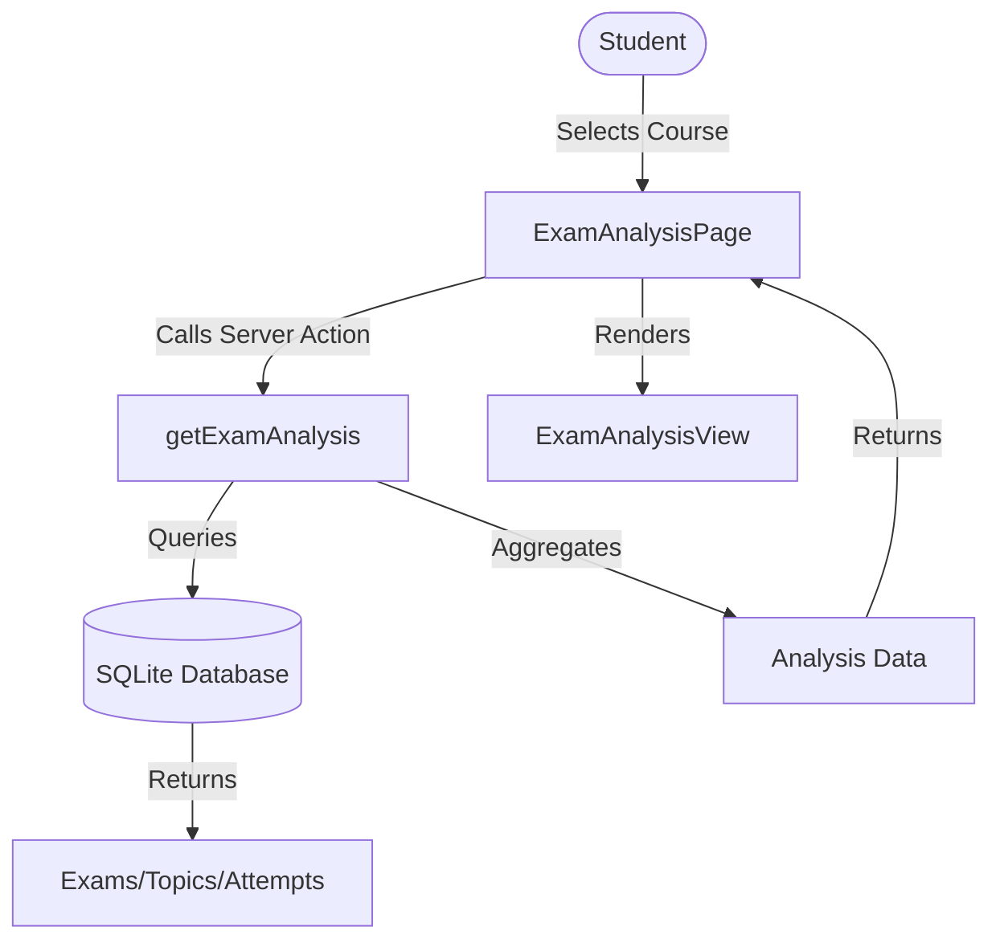

# Exam Analysis Feature

This document details the architecture and usage of the Exam Analysis feature, which provides students with deep insights into their exam readiness based on historical data and personal performance.

---

## Overview

The **Exam Analysis** feature performs a comprehensive analysis of a student's performance against historical exam patterns. It answers the question: *"What do I need to study to pass/ace the exam?"*

**Key capabilities:**
- **Topic Frequency Heatmap:** Visualizes which topics appear most often (Critical/High/Medium/Low priority).
- **Gap Analysis:** Identifies topics with high exam frequency but low personal mastery.
- **Study Strategy:** Generates a phased study plan (Phase 1: Pass, Phase 2: Grade 4, Phase 3: Grade 5).
- **Deep Dives:** Provides specific patterns, common mistakes, and tips for each topic.
- **Estimated Grade:** Predicts exam outcome based on current mastery of weighted topics.

## Architecture

It follows a server-client architecture with **zero AI cost** for the main analysis (relies on statistical aggregation).



### Data Model

The analysis is built on several key data points:
1. **Topic Frequency:** Ratio of questions in a topic vs total questions in the course (weighted by exam appearance if available).
2. **Mastery Level:** Student's Bayesian Knowledge Tracing score (0-5) normalized to 0-1.
3. **Gap Score:** `Frequency * (1 - Mastery)`. High gap = high priority.
4. **Trend:** Slope of accuracy over recent vs older attempts.

### API Reference

#### `getExamAnalysis(courseId: string): Promise<ExamAnalysisData>`

Main server action to generate the report.

**Returns:**
```typescript
interface ExamAnalysisData {
    courseId: string;
    courseName: string;
    overallReadiness: number;       // 0-100%
    estimatedGrade: string;         // A-F
    topicFrequencies: TopicFrequency[];
    studyPhases: StudyPhase[];      // Phased learning path
    topicDeepDives: TopicDeepDive[]; // Detailed insights
    // ...
}
```

#### `getUserCoursesForAnalysis(): Promise<Course[]>`

Returns list of courses the user is enrolled in.

---

## Usage Guide

### For Students
1. Navigate to **Dashboard** > **Courses**.
2. Select a coursecard to open the Course Hub.
3. Click the **Exam Analysis** tab to view insights.
4. Review the **Overview** to see your estimated grade and readiness.
5. Follow the **Study Strategy**:
   - **Phase 1 (Pass)**: Focus ONLY on these topics first. They are the most frequent.
   - **Phase 2 (Grade 4)**: Move to these once Phase 1 is green.
   - **Phase 3 (Grade 5)**: Advanced topics for top grades.
6. Click on any topic in the **Deep Dive** section to see common mistakes and specific exam patterns.

### For Administrators
- Ensure exams are uploaded and questions are tagged with correct topics.
- The analysis quality depends on the volume of questions in the database.
- "Critical" topics are determined by question count frequency. Ensure question distribution matches real exams.

---

## Security

- **Enrollment Check:** Users can only analyze courses they are enrolled in.
- **Data Isolation:** All attempt data is strictly filtered by `session.user.id`.
- **No AI generation:** The analysis is deterministic and safe from hallucination.

