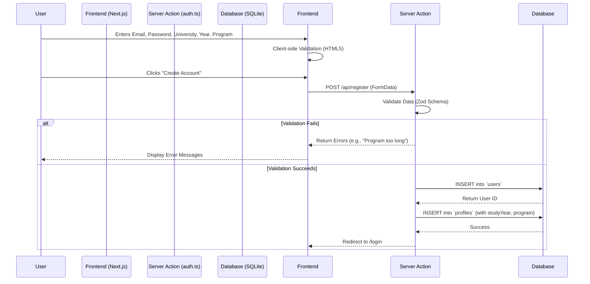

# User Profile Data Flow & Registration

## 1. Overview
The Qmath registration process has been enhanced to collect more detailed academic information from students. This allows for better personalization and future adaptive learning features.

## 2. New Data Fields
The following fields have been added to the user profile:

| Field Name | Type | Description | Validation Rules |
| :--- | :--- | :--- | :--- |
| `studyYear` | Integer | The current year of study (e.g., Year 2). | Min: 1, Max: 10 |
| `universityProgram` | String | The name of the program the student is enrolled in. | Min: 2 characters, Max: 100 characters |
| `universityId` | UUID | Foreign Key linking to the `universities` table. | Must be a valid University ID |

## 3. Data Flow



## 4. Database Schema
The `profiles` table schema has been updated:

```typescript
// db/schema.ts
export const profiles = sqliteTable('profiles', {
    id: text('id').primaryKey().references(() => users.id, { onDelete: 'cascade' }),
    universityId: text('university_id').references(() => universities.id, { onDelete: 'set null' }),
    enrollmentYear: integer('enrollment_year'),
    studyYear: integer('study_year'), // New Field
    universityProgram: text('university_program'), // New Field (mapped from 'program')
    targetGpa: real('target_gpa'),
    createdAt: integer('created_at', { mode: 'timestamp' }).notNull().$defaultFn(() => new Date()),
});
```

## 5. Security & Robustness
- **Input Validation**: Strictly typed validation using Zod ensures only valid integers and reasonable string lengths are accepted.
- **Foreign Key Constraints**: The `universityId` must correspond to a valid university record.
- **Sanitization**: Inputs are handled via parameterized queries (Drizzle ORM) to prevent SQL Injection.

## 6. How to Use (User Guide)
1. Navigate to `/register`.
2. Enter your email and create a password (min 6 chars).
3. Confirm your password.
4. Click "Continue".
5. Enter your First Name and Last Name.
6. Select your University from the dropdown.
7. select your **Year of Study** (1-5).
8. Enter your **Program Name** (e.g., "Computer Science").
9. Agree to the Terms and click "Create Account".
